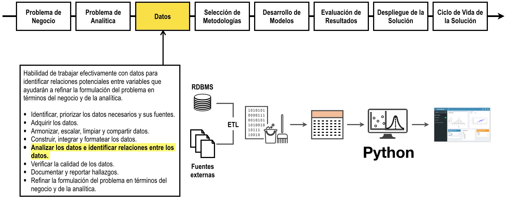

# Programación en Python para Analítica Descriptiva e Inteligencia de Negocios

Haga click [aquí](http://nbviewer.jupyter.org/github/jdvelasq/Python-for-descriptive-analytics/tree/master/)
para visualizar este repositorio en nbviewer.

## Descripción

En este curso se aborda el uso del lenguaje Python para el análisis de datos y la visualización de resultados en el contexto de la analítica descriptiva y la analítica de negocios.

El siguiente grafo muestra donde encaja este tutorial en el proceso.

## Objetivos

Al finalizar este tutorial el lector debe estar en capacidad de usar
el lenguaje Python para:

* Realizar el análisis exploratorio de datos tabulares.
* Construir gráficos exploratorios de los datos.
* Construir dashboards y documentos autocalculables.  

## Requerimientos

Para realizar este tutorial usted debe:

* Tener instalado Python y las librerías `numpy` y `pandas`.

* Tener instalado Jupyter.

**Juan David Velásquez Henao**    
Universidad Nacional de Colombia, Sede Medellín  
Facultad de Minas  
Medellín, Colombia  
[LinkedIn](https://co.linkedin.com/in/juan-david-velásquez-henao-94078979), [GitHub](https://github.com/jdvelasq), [ResearchGate](https://www.researchgate.net/profile/Juan_Velasquez8)

[Licencia](https://github.com/jdvelasq/Python-for-descriptive-analytics/tree/master/LICENSE)
